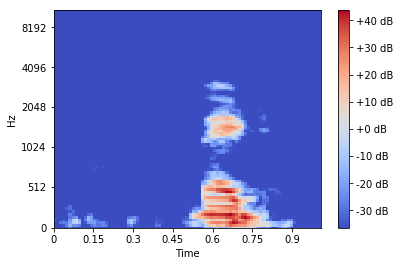

# 논문 연구 수업: Classifiying verbal commands using CNN image classification of command Mel-Spectrograms
This is project was created for the 논문 연구 1 class at Seoul National University

## Setup
Run the following commands to download the data and install the required packages (only tested on linux machines)
```
pip install -r requirements.txt
sh data_download.sh
``` 

Next follow the IPython notebooks.

This project converts audio commands from noise environments in the google command dataset to mel-spectrogram:



Next it uses a 4 layer CNN classifier to classify these images to there corresponding command 

For example, this image above was created from a 1 second audio clip saying 'bed', when this image is fed to 
the CNN classifier, it should be classified as 'bed'